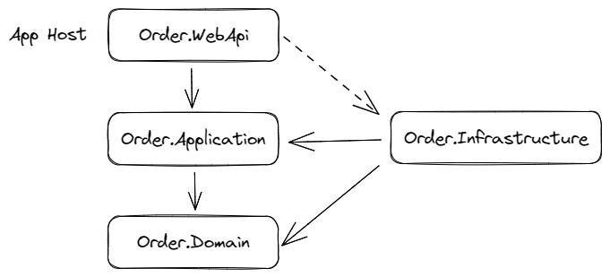

# Order Service

This is a web-based API project built in C# that uses Domain Driven Design (DDD) principles and several technologies such as xUnit, Dapper, AutoMapper, Refit, MySQL, and more. This project is designed to handle order management and processing.

## Architecture

The project follows the DDD approach and has the following structure:

- WebAPI - contains controllers and API endpoints.
- Application - contains application services and DTOs.
- Domain - contains entities, domain services, and repositories.
- Infrastructure - contains data access and external services implementations.

## Tech Stack

The project uses several open-source libraries, including:

- xUnit: a unit testing framework for .NET.
- AutoMapper: a tool for mapping between objects.
- Serilog：a diagnostic logging library for .NET applications. 
